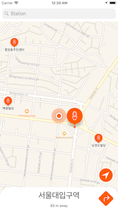
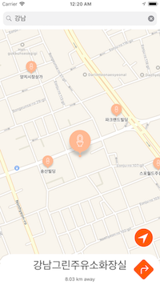

# 
  SeoulToilets 

   
Find nearby open toilets in Seoul quickly!

## Previews
[to: Youtube](https://youtu.be/ulOin1p9VVU)   

## Version History
- v1.0.4: Bugged in nearestLocation (causing Crash!)
- v1.0.5: Released on App Store

## Download

## Things I've learned from this project
1. MapKit and how to link to AppleMaps Direction Mode
2. Mass Annotations and how to clustering them
3. How and When to use LifeCycle functions in AppDelegate
4. Parsing into Codable object from JSON, and custom annotation struct
5. NSPredicate, how to search based on partial string within an array
6. Custom Transitioning between ViewControllers and how to pass data between them
7. How to react to app store reviewers and how to translate Crash Reports
